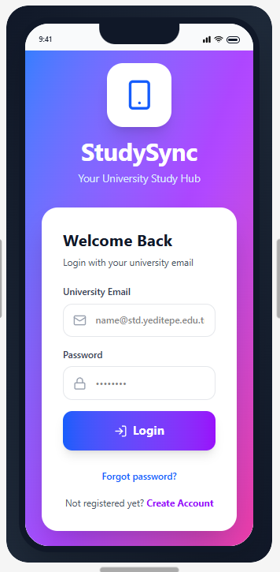
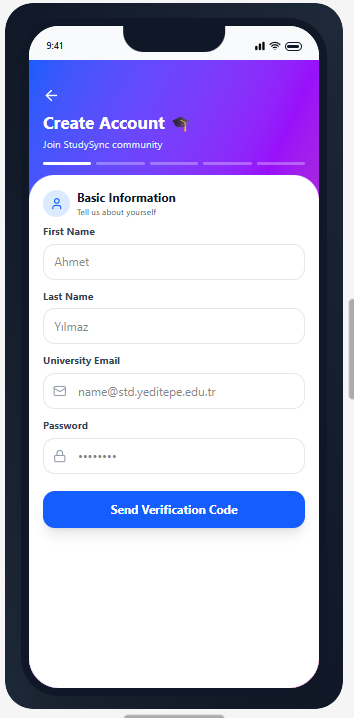
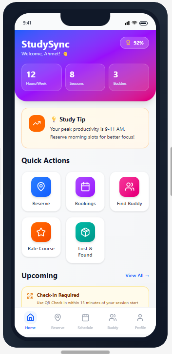
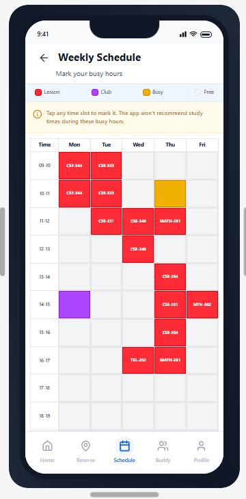
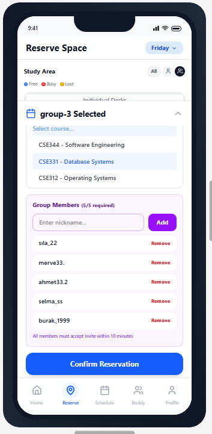
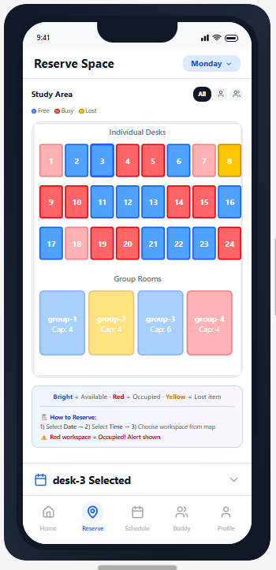

# 📱 StudySync: Smart Study Space & AI Planning Platform

  

> A mobile-first platform designed to optimize study environments, enhance productivity, and enable collaborative learning through AI-powered recommendations.

---

## 📖 Overview

**StudySync** is a mobile application conceptualized to transform traditional campus study environments into efficient, structured, and collaborative ecosystems. 

Developed to solve real-world logistical challenges in academic environments, StudySync addresses common pain points such as:
* **Inefficient Space Utilization:** Eliminating "seat-hogging" in libraries.
* **Time Inefficiency:** Reducing the time wasted physically searching for available study spaces.
* **Poor Study Planning:** Providing structured, workload-aware study schedules.
* **Collaboration Friction:** Facilitating peer discovery for study partnerships.

---

## 🎨 Role & Contribution: UI/UX Designer

As the lead UI/UX Designer for this project, my focus was to ensure an intuitive user experience across all modules, prioritizing usability and visual consistency.

**Key Responsibilities & Workflows:**
* **End-to-End Design:** Designed user flows, navigation architecture, and high-fidelity mobile UI screens.
* **Prototyping & Iteration:** Built interactive prototypes using Figma, leveraging AI-assisted design workflows (Figma AI) for rapid prototyping and ideation.
* **User-Centric Approach:** Ensured all design decisions were rooted in solving specific behavioral problems, from reducing cognitive load during booking to increasing accountability via scoring systems.

---

## ✨ Core Features

### 📍 Dynamic Space Reservation & QR Check-in
A robust booking system that prevents overbooking. Users reserve specific time slots and must physically confirm their presence via a QR scan within the first 15 minutes, preventing "ghost reservations" and automatically freeing unused spaces.

### 🗺️ Live Interactive Map
A real-time visual representation of campus workspaces. The map provides instant availability tracking, allowing users to locate open spots without physical searching.

### 🤖 AI-Driven Study Planner
An intelligent scheduling assistant that analyzes course difficulty, upcoming deadlines, and personal workloads to suggest optimal study periods, effectively preventing schedule conflicts.

### 👥 Study Buddy Matchmaking
A networking feature that connects students based on their registered courses, current availability, and study preferences, fostering collaborative learning environments.

### ⚖️ Responsibility Score System
A gamified accountability system that tracks user behavior. It penalizes no-shows and rewards consistent usage, encouraging a fair and respectful sharing of campus resources.

---

## 📱 UI Showcase

### Authentication & Onboarding

  
  

### Home Dashboard & Scheduling

  
  

### Reservation & Interactive Map

  
  

### Community & Student Tools

  
  
  

---

## 🛠️ Tools & Technologies

* **UI/UX Design:** Figma
* **Workflow Acceleration:** Figma AI (Rapid layout exploration & prototyping)
* **Architecture:** UML & System Modeling
* **Methodology:** Mobile-first, User-Centered Design

---

## 📈 System & UX Highlights

* **Real Problem, Real Solution:** Driven by extensive research into student behavior and campus logistics.
* **Frictionless Experience:** Designed to minimize the steps from searching for a space to successfully checking in.
* **System-Level Thinking:** Scalable design structure supporting real-time updates and concurrent user management logic.

---

## 🚀 Next Steps & Ongoing Development

This repository currently showcases the UI/UX design and system architecture phase of StudySync. 

The project is actively moving forward, and the next phase will focus on **frontend and backend implementation** to bring this product to life. I will be directly contributing to the development and implementation process, ensuring the final application aligns perfectly with the designed user experience and system requirements.

---

[View my GitHub Profile](https://github.com/gulce-celik)

